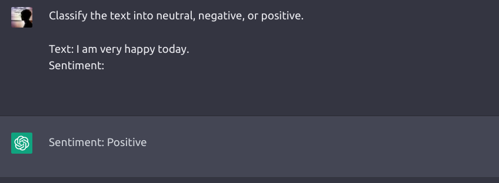
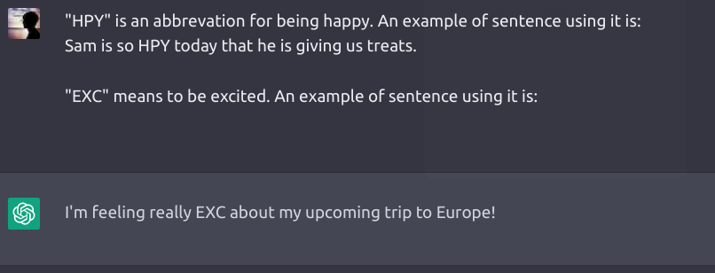
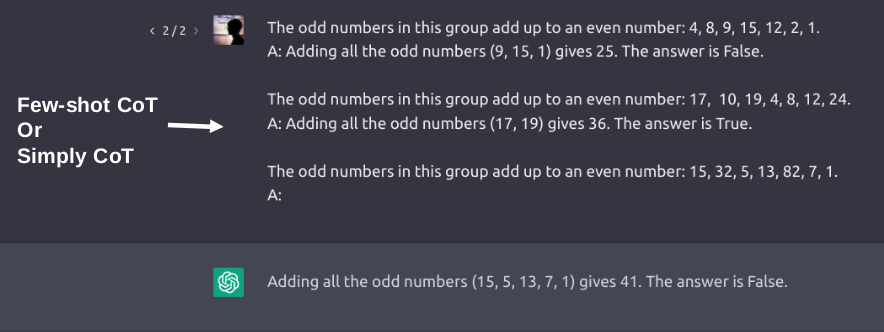
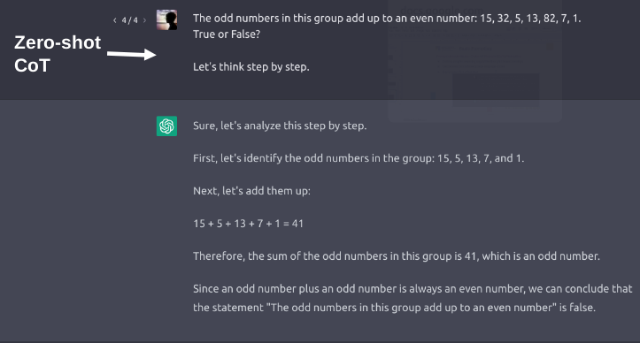
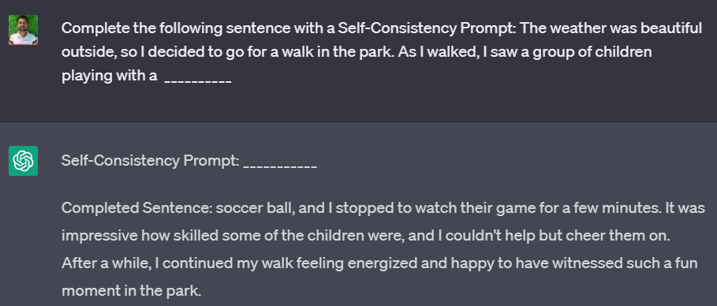

# Prompting techniques

## Contents

1. Zero-shot Prompting
1. Few-shot Prompting
1. Chain-of-Thought (CoT) Prompting
   - Zero-shot CoT
   - Few-shot CoT
1. General Knowledge Prompting
1. Self Consistency Prompting

## Zero-shot Prompting

- Performing tasks from the knowledge of the LLM
- No examples are required
- fall short on more complex tasks

## Few-shot Prompting

- Enables in-context learning
- Providing demonstrations for conditioning subsequent examples
- Format used also plays a key role in performance

## Chain-of-Thought (CoT) Prompting

- Enables complex reasoning capabilities through intermediate steps
- Can be seen with sufficiently large language models
- May be zero-shot or few-shot

## General Knowledge Prompting

- Enables reasoning over general knowledge
- Can be seen with sufficiently large language models
- Generates text that reflects a broad understanding of the world, beyond what has been explicitly included in the training data
- Typically based on factual or conceptual knowledge (common knowledge)

## Self Consistency Prompting

In self-consistency prompting, we generate text that is consistent with a given prompt.

This is done by providing the model with a partial sentence or context, followed by prompting. The model then generates the next logical sentence that follows in a consistent way.

## Automatic Prompt Engineering (APE)

- Generates relevant and informative prompts that guide the model's output
- Steps in APE:
  - **Data collection:** Gather a large and diverse dataset of prompts
  - **Prompt generation:** Automatically generate a set of informative prompts
  - **Prompt filtering:** Selecting the most relevant and informative prompts
  - **Model training:** Fine-tune pre-trained model using selected prompts

## Rewriting and Acting on Contexts Together (ReAct)

Given a context, generating a partial sentence and then rewriting the sentence based on the context to make it more coherent and relevant.

Applications:

- Text summarization
- Machine translation
- Question answering

