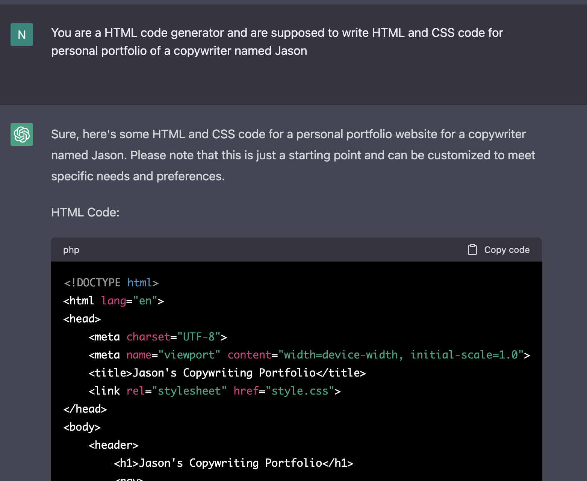

# Use Cases for Prompting

## Contents

1. Generating HTML Code

## Generating HTML Code

- Prompting can be used to generate HTML code
- Examples can be to generate a simple portfolio webpage or a complex webpage from a set of information the user provides

### Example Prompt

### Given Output from ChatGPT

## AutoGPT

- AutoGPT uses GPT-4 instances for text generation
- Internet access for searches and information gathering, and interact with popular platforms
- Long-Term and Short-Term memory management

**Applications:** Develop and manage businesses such as

- creating websites,
- writing articles,
- generating logos,
- marketing products

## Solving Mathematical Problems

## Generating Restaurant Menus or Recipe Suggestions

## Dialogue Generation

## Creative Writing

## Finding Shortest Path

